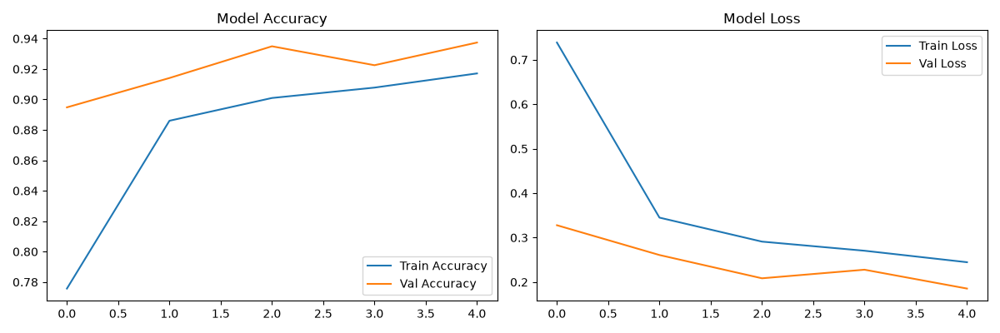
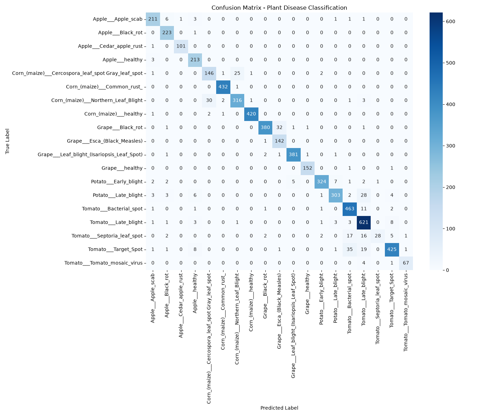

# 🌿 Plant Disease Classification using Deep Learning

An AI-powered system to classify plant leaf diseases using Convolutional Neural Networks (CNNs) and Transfer Learning.

## 📌 Project Overview

This project implements a CNN to classify **19 classes** of plant leaf diseases using the PlantVillage dataset. The goal is to provide an automated, AI-driven tool for early detection of crop diseases, contributing to precision agriculture in developing regions.

## 🛠️ Technologies Used

- **Python 3.12**
- **TensorFlow 2.21 / Keras 3.15** (Transfer Learning with MobileNetV2)
- **NumPy, Matplotlib, Seaborn** (Data visualization)
- **Scikit-Learn** (Evaluation metrics)

## 📂 Dataset

- **Source:** [PlantVillage Dataset](https://www.kaggle.com/datasets/abdallahalidev/plantvillage-dataset)
- **Total Images:** 15,915 color images
- **Classes:** 19 (Apple, Corn, Grape, Potato, Tomato)
- **Split:** 80% Training (12,725) / 20% Validation (3,190)

## 🧠 Model Architecture

- **Base Model:** MobileNetV2 (pre-trained on ImageNet, frozen layers)
- **Custom Head:** Global Average Pooling → Dropout (0.2) → Dense (Softmax)
- **Input Size:** 128×128×3
- **Optimizer:** Adam
- **Loss:** Categorical Crossentropy
- **Augmentation:** Rotation, Zoom, Width/Height Shift, Horizontal Flip

## 📊 Results

**Overall Validation Accuracy: 92%**

| Metric | Score |
|---|---|
| Accuracy | 0.92 |
| Macro Avg F1 | 0.89 |
| Weighted Avg F1 | 0.92 |

### Per-Class Performance Highlights

| Class | Precision | Recall | F1-Score | Support |
|---|---|---|---|---|
| Grape___healthy | 1.00 | 1.00 | 1.00 | 85 |
| Corn___healthy | 1.00 | 0.99 | 0.99 | 233 |
| Corn___Common_rust | 0.98 | 1.00 | 0.99 | 238 |
| Grape___Leaf_blight | 0.98 | 0.99 | 0.98 | 216 |
| Tomato___Late_blight | 0.85 | 0.94 | 0.89 | 360 |
| Tomato___Septoria_leaf_spot | 0.87 | 0.33 | 0.47 | 40 |

### Training History



### Confusion Matrix



## 🔬 Research Motivation

This project was motivated by a specific research question: **how to build robust deep learning models for agricultural classification when training data is imbalanced across disease classes?**

This challenge appears clearly in the results:
- **Majority classes** (e.g., Corn___healthy, 929 training images): **F1 = 0.99**
- **Minority classes** (e.g., Tomato___Septoria, 160 training images): **F1 = 0.47**

This mirrors the class imbalance problem described in recent work on tail-aware deep learning for time series (Niu et al., *Hydrology* 2025) — a topic I plan to explore further in PhD research.

## 🚀 How to Run

### 1. Clone the repository
```bash
git clone https://github.com/daniel-mapala-dev/plant-disease-classification.git
cd plant-disease-classification